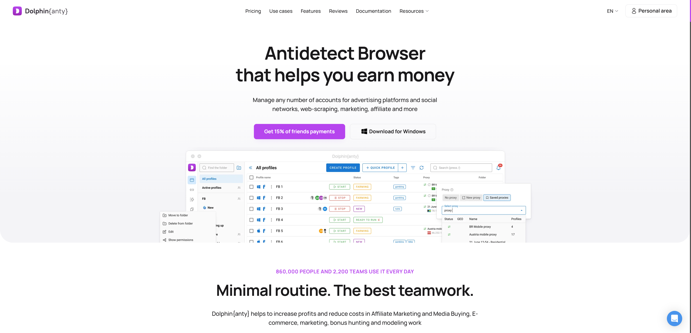
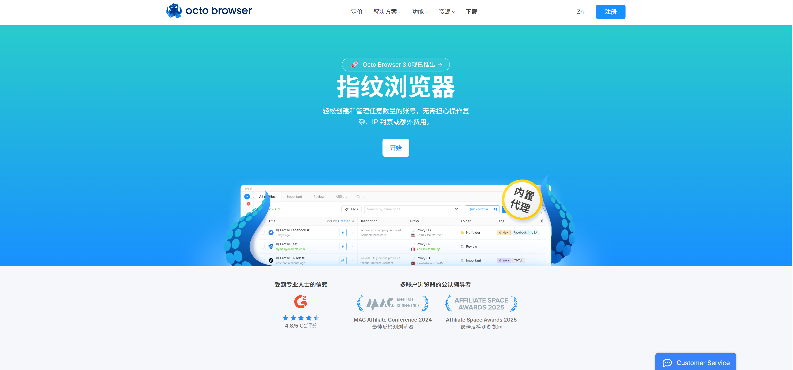
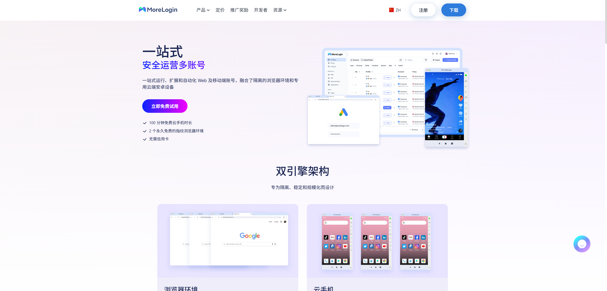
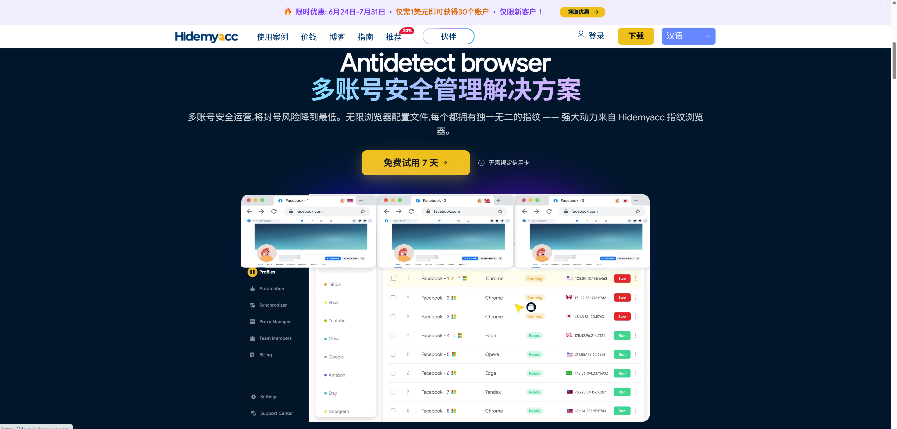
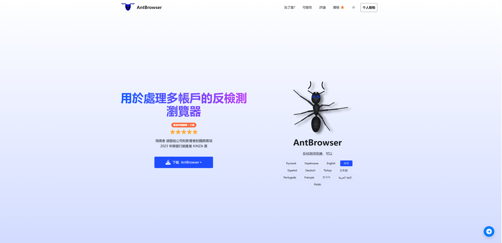
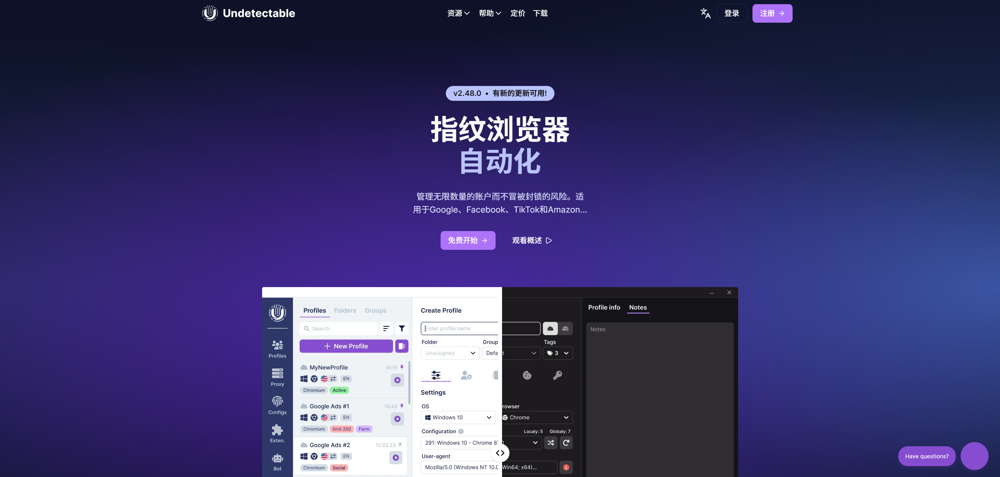

# Best Antidetect Browsers in 2026: 6 Multi-Account Browsers Compared

**English** | [简体中文](README.md)

> An independent guide to antidetect browsers for affiliate marketing, e-commerce, social media management, advertising, and multi-account teams.

Looking for the **best antidetect browser, anti-detect browser, multi-account browser, or browser fingerprint manager**? This guide compares six international options: Dolphin Anty, Octo Browser, MoreLogin, Hidemyacc, AntBrowser, and Undetectable. It covers browser profile isolation, fingerprint controls, proxy support, team collaboration, and automation so that you can shortlist the right tool for your workflow.

> [!IMPORTANT]
> An antidetect browser can help isolate browser environments, but it cannot guarantee that accounts will never be linked, restricted, or banned. Account safety also depends on proxy quality, user behavior, payment details, registration data, and the rules of each platform. Use these tools only for lawful purposes and in compliance with applicable platform terms.

## Quick Comparison of the Best Antidetect Browsers

| Antidetect browser | Key strengths | Best for | Automation and teamwork | Official website |
| --- | --- | --- | --- | --- |
| Dolphin Anty | Beginner-friendly interface, bulk tools, free plan | Affiliates, advertising, individuals, and teams | API, bulk actions, team permissions | [Dolphin Anty Official Website](https://dolphin-anty.net/a/4816574/) |
| Octo Browser | Detailed fingerprint controls and strong developer tooling | Automation teams, e-commerce, and data workflows | API, Playwright, Puppeteer, Selenium, teamwork | [Octo Browser Official Website](https://octobrowser.org/signup/?p=10297090) |
| MoreLogin | Browser profiles and cloud phones in one workspace | Web and mobile multi-account operations | RPA, API, synchronizer, team permissions | [MoreLogin Official Website](https://www.morelogin.com/?from=AAyOVekQaXtA) |
| Hidemyacc | High-volume profile management, teams, and API access | Agencies and larger multi-account teams | API, roles, permissions, bulk management | [Hidemyacc Official Website](https://go.hidemyacc.com/abing) |
| AntBrowser | Affordable entry point, cloud profiles, data recovery | Budget-conscious users and small teams | Team permissions, profile transfers, Time Machine | [AntBrowser Official Website](https://antbrowser.pro/reg/54953) |
| Undetectable | Local profiles, fingerprint configuration store, synchronizer | Users who value local storage and flexible profiles | Local API, synchronizer, team features | [Undetectable Official Website](https://undetectable.io/?r=4JH6A) |

Features, free allowances, supported operating systems, and subscription prices may change. Always check the latest information on the vendor's website before purchasing.

## What Is an Antidetect Browser?

Websites can identify visitors through more than an IP address and cookies. They may combine User-Agent, Canvas, WebGL, installed fonts, screen resolution, time zone, language, and hardware properties into a browser fingerprint. Incognito mode clears or limits some local browsing data, but it does not automatically create a stable and fully isolated device identity for every session.

An antidetect browser typically gives each browser profile separate cookies, local storage, cache, and fingerprint settings. When paired with an appropriate proxy, these isolated profiles can help teams separate clients, stores, projects, and approved testing environments.

Common use cases include:

- managing multiple e-commerce stores or client workspaces;
- affiliate marketing and advertising account operations;
- social media teams and content workflows;
- market research, website testing, and compliant automation;
- assigning isolated browser environments to agency clients.

## 1. Dolphin Anty: An Accessible Antidetect Browser for Beginners

Dolphin Anty is a multi-account browser with isolated profiles, proxy management, cookie tools, bulk actions, and team collaboration. Its interface and workflow are relatively easy to understand, making it a practical starting point for new antidetect browser users. It also offers features suited to affiliate marketers, media buyers, and teams managing larger sets of profiles.

### Main Dolphin Anty Features

- isolated browser profiles for separate accounts and projects;
- proxy configuration, cookie importing, tags, and profile organization;
- bulk profile creation and management tools;
- team members, roles, and profile sharing;
- API integration with Selenium, Playwright, and Puppeteer;
- free and paid plans for different profile volumes, subject to current terms.

**Best for:** affiliate marketers, advertising teams, and users who want to test a free plan before committing to a paid antidetect browser.

**Official website:** [Dolphin Anty Official Website](https://dolphin-anty.net/a/4816574/)

## 2. Octo Browser: Strong Automation and Team Workflows

Octo Browser focuses on fingerprint management, bulk profile operations, and automation APIs. Users can work with browser fingerprints, proxies, cookies, tags, and folders, while teams can share or transfer profiles without rebuilding their environments. Its developer tooling makes it particularly relevant to businesses connecting a multi-account browser to existing scripts, testing systems, or data workflows.

### Main Octo Browser Features

- configurable browser fingerprint parameters;
- profile creation, duplication, import, export, and transfer;
- team collaboration and member access controls;
- cookie imports and Cookie Robot functionality;
- API management for profiles, proxies, tags, and teams;
- support for Playwright, Puppeteer, Selenium, and CDP automation;
- one-time profiles for automated tasks that do not require persistent state.

**Best for:** technical operations teams, automation developers, e-commerce businesses, and users who need detailed control over many browser profiles.

**Official website:** [Octo Browser Official Website](https://octobrowser.org/signup/?p=10297090)

## 3. MoreLogin: Antidetect Browser and Cloud Phone in One Workspace

MoreLogin combines isolated desktop browser profiles with cloud-based Android devices. Browser environments serve web accounts, while cloud phones support mobile workflows that require an Android operating system. Teams managing both websites and mobile apps can therefore keep the two types of environments in one workspace instead of switching between unrelated products.

### Main MoreLogin Features

- persistent, isolated browser environments for web accounts;
- cloud phones running full Android environments;
- optional encrypted cloud synchronization for browser data;
- no-code RPA, API access, and a window synchronizer;
- roles, environment assignment, and team access controls;
- free browser profiles and introductory cloud phone usage, subject to current terms.

**Best for:** social media, e-commerce, and marketing teams that need both a desktop antidetect browser and Android cloud phones.

**Official website:** [MoreLogin Official Website](https://www.morelogin.com/?from=AAyOVekQaXtA)

## 4. Hidemyacc: Scalable Multi-Account Browser for Teams

Hidemyacc provides isolated browser profiles, fingerprint management, and proxy connections, with an emphasis on bulk operations, API access, sub-accounts, and role-based permissions. These capabilities make it a candidate for agencies and larger operations that need to manage many profiles across departments, clients, or campaigns.

### Main Hidemyacc Features

- browser profiles with independent cookies, storage, and fingerprint settings;
- support for common proxy protocols, including HTTP, HTTPS, and SOCKS5;
- bulk profile management and API access;
- sub-accounts, roles, profile groups, and access permissions;
- workflows that can scale from small tests to larger profile volumes;
- a limited free trial, with current limits shown on the official website.

**Best for:** agencies, larger operations teams, and users who prioritize profile volume, access control, and API integration.

**Official website:** [Hidemyacc Official Website](https://go.hidemyacc.com/abing)

## 5. AntBrowser: Affordable Multi-Accounting with Data Recovery

AntBrowser is a Chromium-based multi-account browser offering desktop and mobile device parameter simulation, proxy integration, cloud profiles, and teamwork. Its Time Machine feature can restore profile data to existing checkpoints, which may be useful to teams concerned about accidental changes or profile data loss.

### Main AntBrowser Features

- controls for User-Agent, time zone, language, screen, and graphics-related fingerprint properties;
- HTTP(S), SOCKS4, and SOCKS5 proxy support;
- cloud profiles with synchronization across computers;
- bulk creation, cookie imports, and browser extensions;
- team permissions, operation logs, and profile transfers;
- Time Machine checkpoints for profile data recovery.

**Best for:** budget-conscious individuals, smaller teams, and users who value profile checkpoint recovery.

**Official website:** [AntBrowser Official Website](https://antbrowser.pro/reg/54953)

## 6. Undetectable: Flexible Local Profiles and Fingerprint Configurations

Undetectable is designed for social media, marketplaces, and other multi-account workflows. It supports local and cloud browser profiles, fingerprint configurations, Cookie Bot, a synchronizer, and a local API. Its local profile model can be attractive to users who want greater control over data storage and profile strategy.

### Main Undetectable Features

- creation and management of multiple isolated browser profiles;
- local or cloud profile storage options;
- fingerprint configurations and a configuration store;
- Cookie Bot, bulk operations, and a synchronizer;
- Local API for profile management and automation;
- team collaboration and profile-sharing capabilities.

**Best for:** individuals and teams that prefer local profiles, flexible fingerprint resources, or Local API automation.

**Official website:** [Undetectable Official Website](https://undetectable.io/?r=4JH6A)

## How to Choose the Best Antidetect Browser

Do not compare these tools on price alone. Start with a few low-risk test profiles, run your actual workflow, and evaluate the result before committing to a long subscription.

1. **Check operating system support.** Confirm that your current Windows, macOS, or Linux version is supported.
2. **Estimate profiles and team seats.** Some plans charge by profile count, while team members or API access may cost extra.
3. **Review data storage.** Choose local, cloud, or encrypted synchronization according to your security requirements and backup policy.
4. **Test proxy compatibility.** Fingerprint isolation and network identity are separate layers. Test supported protocols, connection stability, and target-region quality.
5. **Assess automation requirements.** Verify API plan availability, rate limits, and compatibility with Selenium, Playwright, or Puppeteer.
6. **Review permissions and audit tools.** Teams should examine roles, password visibility, activity logs, and access removal procedures.
7. **Read the target platform's rules.** Rules for multiple accounts, automation, scraping, and advertising vary. A tool does not make a prohibited workflow compliant.

### Quick Recommendations by Use Case

- For a low-cost first test, compare the current free options from **Dolphin Anty, MoreLogin, and AntBrowser**.
- For mature APIs and browser automation frameworks, consider **Octo Browser**.
- For browser profiles and Android devices in one platform, consider **MoreLogin**.
- For high-volume profile management and structured teams, compare **Hidemyacc**.
- For local profiles and flexible fingerprint configurations, review **Undetectable**.
- For checkpoint recovery and an affordable entry point, review **AntBrowser**.

## Frequently Asked Questions

### Are an antidetect browser and a proxy the same thing?

No. An antidetect browser manages browser properties, cookies, local storage, and profile isolation. A proxy changes the network exit IP. Many workflows use both, while keeping the proxy location, time zone, language, and profile settings reasonably consistent.

### Can incognito mode replace an antidetect browser?

Not completely. Incognito mode mainly limits the persistence of local history and cookies. It does not automatically build stable, separate device fingerprints for multiple long-term profiles.

### Does an antidetect browser prevent account bans?

No tool can guarantee that. Platforms may evaluate identity details, payment information, IP quality, device properties, account behavior, and content. Browser profile isolation is only one part of account operations.

### Is a free antidetect browser suitable for long-term use?

A free plan is useful for testing the interface, compatibility, and basic workflow. Before long-term or team use, check profile limits, data synchronization, API access, permissions, technical support, and backup capabilities.

### How should a team organize browser profiles?

Group profiles by client, platform, or project; apply least-privilege access; avoid sharing administrator passwords; and document onboarding, handover, and access removal. Back up important profile data where the selected product supports it.

## Affiliate Disclosure

The official website buttons in this guide contain affiliate referral links. If you register or purchase through one of these links, the project maintainer may receive a commission, generally at no extra cost to you. These commissions help maintain and update this comparison. The content is provided for product research only and does not guarantee security, platform acceptance, or earnings.

## Updates and Corrections

This guide is based on publicly available product information. Antidetect browser features, plans, free allowances, and operating system support can change. The vendor's current website and service terms always take precedence. If you find outdated information, please open an Issue or submit a Pull Request.

---

If this **2026 antidetect browser comparison and multi-account browser guide** helped you, consider starring the repository so you can find future updates.
